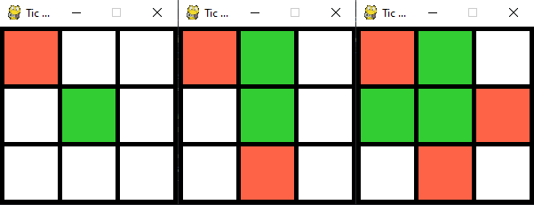

# tictac-ai
**TIC-TAC-TOE game with an AI**

Classic tic-tac-toe game implemented in Python with Pygame for visualization. The user plays green against the computer (red). First move is made by the user and starts the game. The AI uses minimax algorithm without depth limit to compute all the possible next movements of itself and the human and make the next move. 

**tic_game_ai.py:** Main .py file, uses pygame to paint a grid and manages users input and updating
the game grid as User and AI make the movements.

**tic_helper.py:** Helper .py file where the main functions of *tic_game_ai.py* are defined. The 
algorithm of the AI is Minimax without depth limit, scanning all possibilities.
  
